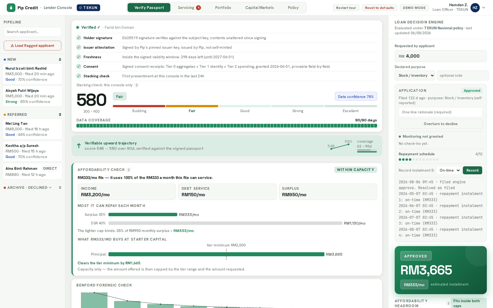
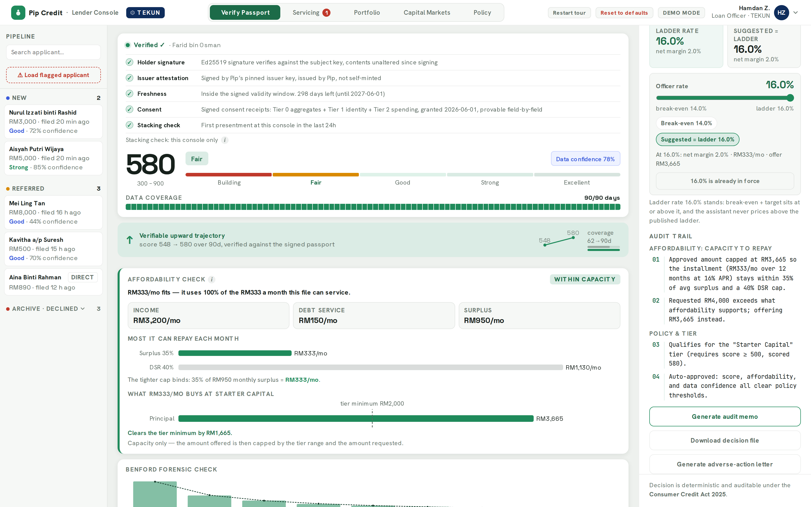
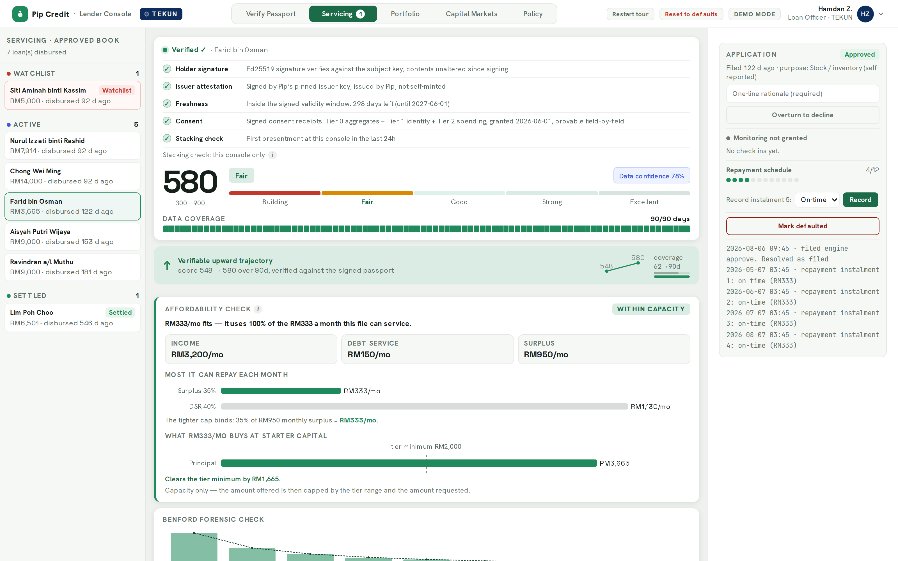
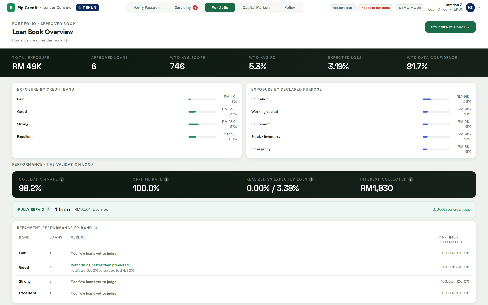
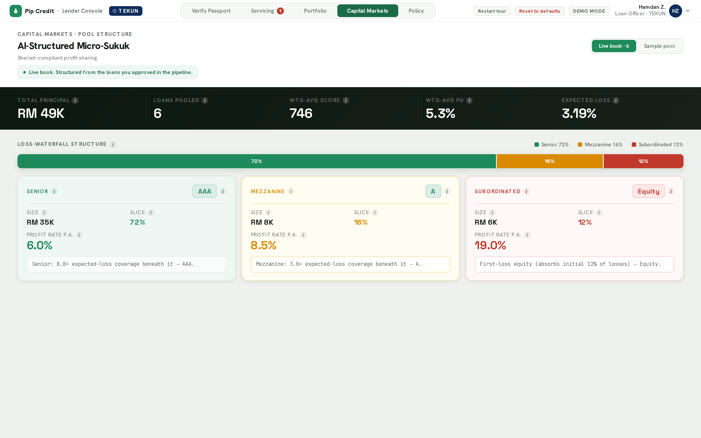
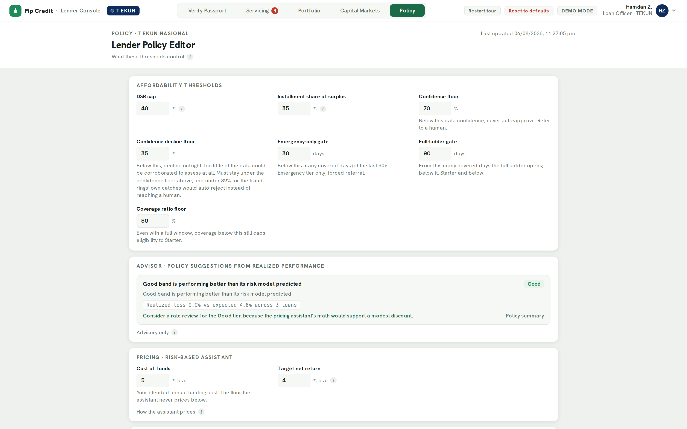

# LenderConsole: Pip Credit lender console (web)

The B2B, web-first counterpart to the Pip Credit borrower app. Built with Next.js
(App Router) for the MAIC Nexus 2026 entry: a dense, compliance-grade UI for a loan
officer, not a consumer app. For the product pitch and the system architecture, see the
[root README](../README.md).

---

## Screenshots

<table>
<tr>
<td align="center" width="33%">
<br>
<sub><b>Verify Passport</b><br>Signature check + trust panel</sub>
</td>
<td align="center" width="33%">
<br>
<sub><b>Loan Decision Engine</b><br>Verdict + numbered audit trail</sub>
</td>
<td align="center" width="33%">
<br>
<sub><b>Servicing</b><br>Post-loan check-ins and the watchlist</sub>
</td>
</tr>
<tr>
<td align="center" width="33%">
<br>
<sub><b>Portfolio</b><br>Book-wide validation loop</sub>
</td>
<td align="center" width="33%">
<br>
<sub><b>Capital Markets</b><br>Rated tranches over a loan pool</sub>
</td>
<td align="center" width="33%">
<br>
<sub><b>Policy</b><br>Affordability caps, pricing ladder, AI advisor</sub>
</td>
</tr>
</table>

---

## What's here

This is not a static mockup. The five header tabs (`app/Console.tsx`) are each backed by
real logic in `lib/` and a matching API route in `app/api/`:

- **Verify Passport**: paste a borrower passport code → Ed25519 signature check
  (`lib/passport.ts`) → a privacy-locked verified card (aggregate-only, no raw
  transactions), a 7-factor breakdown with provenance, and a deterministic **Loan
  Decision Engine** (`lib/decidePriced.ts`, APPROVE / REFER / DECLINE with a numbered
  audit trail, built to be auditable under the Consumer Credit Act 2025).
  - **Fraud alert mode**: when the ML model flags fabricated data, the console shifts to
    red: a data-integrity alert banner, a Data Forensics panel (ML probability,
    round-number ratio, Benford deviation), an invalidated score, and a forced **REFER**
    that routes the case to manual review.
- **Servicing**: post-loan check-ins and an early-warning watchlist (`lib/servicing.ts`,
  `lib/earlyWarning.ts`).
- **Portfolio**: book-wide stats and a validation loop over booked loans (`lib/portfolio.ts`,
  `lib/bookStats.ts`).
- **Capital Markets**: the institutional view: an AI-structured micro-sukuk pool with a
  loss-waterfall bar and rated tranches (Senior / Mezzanine / Subordinated Equity), priced
  deterministically from pool expected loss (`lib/securitization.ts`).
- **Policy**: affordability caps, pricing, and the product ladder that borrowers see
  published in the coach app (`lib/policyStore.ts`, `PolicyTab.tsx`), plus an AI policy
  advisor.

Route handlers under `app/api/` (`apply`, `offers`, `policy`, `servicing`, `memo`,
`adverseAction`, `agents`, `advisor`, `lenders`, `reset`) wire the UI to that logic and to
the borrower app: `apply` receives a passport directly from PipComp, and `offers` lets a
borrower see and accept a published offer. Persistence is `lib/kvStore.ts`: Upstash Redis
when deployed on Vercel, local JSON files under `.data/` in dev.

## Try it

- **Verify**: click **Load sample** to load a clean, verified applicant, or **Load
  flagged** to switch the console into the red fraud-alert state.
- **Capital Markets**: toggle the header tab to see the pool/tranche view.
- **Policy**: edit affordability caps or pricing and save; the change is what the
  borrower app's Passport Builder Coach reads to simulate a path to qualifying.

## Run

```bash
npm install
cp .env.example .env.local   # see below
npm run dev      # http://localhost:3000
npm run build && npm start   # production
```

Everything works with an empty `.env.local`: without a Groq key the AI Assessment Panel
and policy advisor are just unavailable, and without a KV/Upstash store, policy edits and
the direct-apply mailbox persist to local JSON files instead (fine for dev, but a Vercel
serverless deploy needs a real store attached or edits will silently reset between
requests (see `docs/deploy.md`). The full variable list, with comments, is in
`.env.example`:

- `GROQ_API_KEY` (server-side only): powers the AI Assessment Panel and policy advisor.
- `GROQ_MODEL` (optional): defaults to `meta-llama/llama-4-scout-17b-16e-instruct`.
- `KV_REST_API_URL` / `KV_REST_API_TOKEN` or `UPSTASH_REDIS_REST_URL` /
  `UPSTASH_REDIS_REST_TOKEN` (optional): persistent store for the Policy tab and the
  direct-apply mailbox.
- `NEXT_PUBLIC_BORROWER_APP_URL` (optional): where the guided tour links back to; defaults
  to the hosted demo.

Fonts (Hanken Grotesk, Space Grotesk, JetBrains Mono) are loaded via `next/font/google`.

## Testing

```bash
npm test          # runs a test-integrity guard, then the vitest suite
npm run typecheck  # tsc --noEmit
```

The integrity guard (`scripts/check-test-integrity.js`) was added after an incident where
test suites were silently stubbed out; it fails the run if that happens again.
