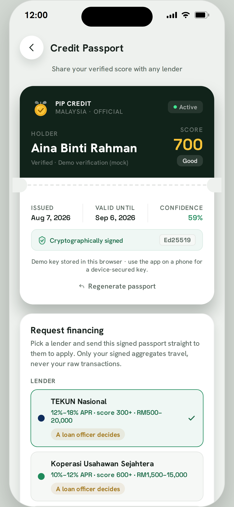
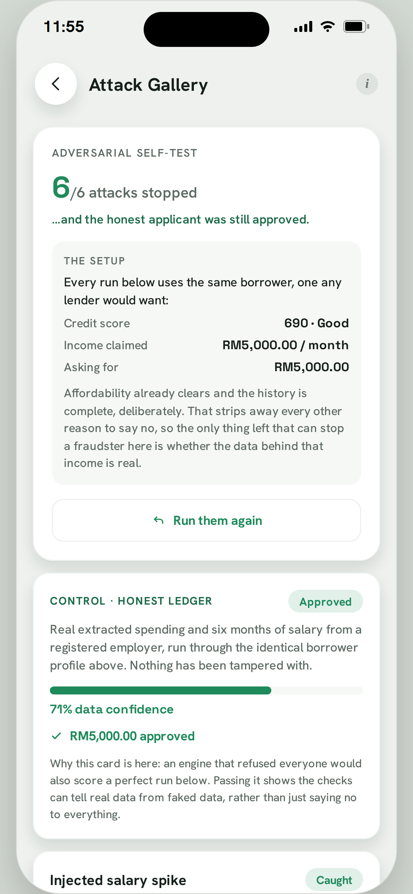

# Pip Credit

> Credit infrastructure for lenders who are now required to assess borrowers who have no
> credit file.

Pip Credit turns a borrower's bank and e-wallet screenshots into a signed, fraud-checked
**Credit Passport**. A licensed lender verifies that passport offline and runs an auditable
affordability decision without ever seeing a raw transaction.

Built for **MAIC Nexus 2026, Track T3 (Financial Services)**.

**Try it now:**
[Borrower app](https://pip-expenses-tracker.vercel.app) ·
[Lender console](https://pip-lender-console.vercel.app)

---

## The problem

A hawker, a Grab driver, or a Shopee seller has a bank account and steady earnings, but
nothing a credit officer can put in a file. The barrier is not access to banking. It is that
a bank account produces no assessable record when income arrives without a payslip. So the
lender declines by default, and the borrower stays invisible.

Pip Credit makes the un-assessable assessable: trust is scored rather than assumed.

## How it works

1. **Capture.** The borrower attaches screenshots of their e-wallet or bank history. A vision
   model reads them into structured transactions, so no bank API is required.
2. **Score.** A deterministic engine turns those transactions into a 300 to 900 score across
   seven plain-English factors, then caps the result by a **data-confidence** signal so a
   thin or unverified file cannot claim a strong score.
3. **Check.** A fraud and data-confidence layer (Benford conformity, round-number ratios,
   duplicate detection, income point-anomaly, and a trained logistic model) raises the cost
   of fabricating a profile and caps what an unverified score is allowed to claim. It makes
   fabrication expensive rather than impossible, which is the honest description of what
   statistical detection on self-asserted data can do.
4. **Carry.** The borrower gets a **Credit Passport**: a compact, Ed25519-signed credential
   they can present to any lender. It carries signed aggregates only. Raw transactions never
   leave the device.
5. **Lend.** The lender verifies the passport in the console and runs a deterministic,
   policy-enforced decision (APPROVE, REFER, or DECLINE) with a numbered audit trail and an
   adverse-action notice.

## Scope: what is real and what is not

This is prototype software built for a competition, and the difference between the parts that
are production-shaped and the parts that are demo scaffolding matters more than any feature
list. Nothing below is hidden elsewhere in the repo.

| Component | Status |
| --- | --- |
| Vision extraction (screenshot to transactions) | Real, running against Groq with a Gemini fallback. Accuracy has **not** been measured against a labelled set. The scoring harness is built and unit-tested; the dataset is pending. |
| Credit score, affordability, decision engine | Real, deterministic, unit-tested. **Not yet validated against default outcomes**, so it is an explainable assessment rather than a proven predictor of repayment. |
| Fraud model | Real logistic regression running offline in the app. The genuine class is real bank data (Berka, PKDD'99, CC0). **The fraud class is generated by our own perturbation script**, so the reported AUC of 0.897 measures separation from that specific procedure, not detection of observed fraud. |
| Integrity checks | Four of five are active. Running-balance reconciliation is implemented and unit-tested but **inert on live data**, because extraction does not yet capture the balance column. |
| Passport signing | Real Ed25519, holder key plus issuer attestation. **The issuer secret currently ships in the client bundle**, which means the "not self-minted" guarantee is a demo simplification. Production requires server-side signing. |
| eKYC | NRIC parsing is real. The identity provider behind it is a **mock**, sitting behind a real provider interface. |
| Repayment and servicing data | Demo-seeded. The pipeline is real; the outcomes are not yet. |

The fraud model was trained offline and exported as weights the app runs locally. This is an
academic prototype, not a production credit bureau.

## Screenshots

<table>
<tr>
<td align="center" width="25%">
<br>
<sub><b>Dashboard</b><br>Cash flow and a compact score card</sub>
</td>
<td align="center" width="25%">
<br>
<sub><b>Credit Profile</b><br>300 to 900, with a seven-factor breakdown</sub>
</td>
<td align="center" width="25%">
<br>
<sub><b>Credit Passport</b><br>The signed credential a borrower carries</sub>
</td>
<td align="center" width="25%">
<br>
<sub><b>Attack Gallery</b><br>Six fabrication attacks, run live in the app</sub>
</td>
</tr>
<tr>
<td align="center" colspan="2">
<br>
<sub><b>Verify Passport</b><br>Signature, issuer, freshness, consent, and stacking checks</sub>
</td>
<td align="center" colspan="2">
<br>
<sub><b>Loan Decision Engine</b><br>APPROVE / REFER / DECLINE with a numbered audit trail</sub>
</td>
</tr>
</table>

The attack gallery is worth a look. The app runs six fabrication attacks against a genuine
profile and reports which integrity checks caught each one, while the honest control run
still gets approved. A credit product that ships its own fraud self-test is unusual, and it
is the fastest way to see whether the checks do anything.

## What is in this repo

| Folder | What it is | Stack |
| --- | --- | --- |
| [`PipComp/`](PipComp) | **Borrower app** (mobile): capture, score, passport, loans | Expo / React Native + TypeScript, on-device SQLite |
| [`LenderConsole/`](LenderConsole) | **Lender console** (web): verify passports, price and decide, structure loan pools | Next.js (App Router) + TypeScript |

### Borrower app

An animated score gauge with a data-confidence badge, a seven-factor breakdown with reasons,
and a boarding-pass-style signed passport with a QR code. Budgeting is benchmarked against
Belanjawanku, the reference budget published by Universiti Malaya's Social Wellbeing Research
Centre and the EPF, so the guidance follows a national standard rather than a proprietary
one. Pip, a coin-sprout mascot, fronts an optional AI coach that explains score movements in
plain language. Everything runs on-device against local SQLite, with no backend and no
account.

### Lender console

Paste a passport code and the console runs an Ed25519 signature check, verifies the issuer
attestation, checks freshness and consent receipts, and flags repeat presentment within 24
hours as possible loan stacking. What follows is a privacy-locked verified card carrying
aggregates only, a seven-factor table with provenance, and a deterministic decision engine
capped by real affordability.

When the integrity layer flags fabricated data, the console shifts into a data-integrity
alert with a forensics panel and routes the case to manual review rather than producing a
decision. A separate Capital Markets tab pools approved loans into a tranched structure with
a loss waterfall, rated deterministically by expected loss. That tab is structural modelling
only, and no Shariah certification is claimed for it.

## Architecture

There is no shared backend and no blockchain. The two apps deploy independently on Vercel,
and the only thing that crosses between them is the Credit Passport: a compact, Ed25519-signed
string. The borrower app produces it locally and the console verifies it offline against a
pinned public key, so the trust boundary is the credential itself rather than a live API call.

```mermaid
flowchart LR
    subgraph Borrower["PipComp: borrower app (Expo / React Native)"]
        direction TB
        Cap["Screenshot capture"] --> Vision["AI vision extraction<br/>(Groq, Gemini fallback)"]
        Vision --> DB[("On-device SQLite<br/>src/db/")]
        DB --> Score["Deterministic credit score<br/>src/lib/creditScore.ts"]
        Score --> Fraud["Fraud / data-confidence layer<br/>src/lib/fraudModel.ts, dataConfidence.ts"]
        Fraud --> Sign["Dual signing<br/>holder key: src/crypto/keys.ts<br/>issuer key: src/crypto/issuer.ts"]
        Sign --> Passport(["Signed Credit Passport"])
    end

    subgraph Lender["LenderConsole: lender console (Next.js)"]
        direction TB
        Verify["Verify signatures<br/>lib/passport.ts"] --> Decide["Deterministic decision engine<br/>lib/decidePriced.ts"]
        Decide --> Store[("Policy & queue store<br/>lib/kvStore.ts<br/>Upstash Redis on Vercel,<br/>local JSON in dev")]
        Store --> Work["Workbench: queues,<br/>servicing, check-ins"]
        Work --> Capital["Capital Markets:<br/>lib/securitization.ts"]
    end

    Passport -->|"app/api/apply: direct submit"| Verify
    Passport -.->|"paste passport code (manual demo path)"| Verify
    Store -.->|"app/api/offers: publish / poll / accept"| Passport
```



`app/api/offers` is the one live network call between the two apps. It lets a borrower see and
accept a lender's published offer during the guided demo, and the core path (verify a
passport, get a decision) works from a pasted code without it.

**Borrower app (`PipComp/`)**

| Path | Role |
| --- | --- |
| `src/screens/` | Onboarding, dashboard, credit profile, loans, passport ceremony, attack gallery |
| `src/lib/` | Scoring, fraud and data-confidence, offers, passport assembly |
| `src/db/` | On-device SQLite schema and repositories |
| `src/crypto/` | Ed25519 holder and issuer signing |
| `src/data/` | Demo personas and seed data used for judging |

**Lender console (`LenderConsole/`)**

| Path | Role |
| --- | --- |
| `app/api/` | Route handlers: `apply`, `offers`, `policy`, `servicing`, `memo`, `adverseAction`, `agents` |
| `lib/` | Passport verification, pricing, the decision engine, securitization, the KV store |
| `app/` | Console UI: verify, servicing, portfolio, capital markets, policy tabs |

There is no blockchain, on purpose. Tamper-evidence comes from the Ed25519 signature rather
than a ledger, and a public chain would work against the on-device privacy model. The
reasoning is written up in
[`PipComp/docs/why-not-blockchain.md`](PipComp/docs/why-not-blockchain.md).

## Verifying the claims

Every number quoted above regenerates from this repo.

```bash
cd PipComp && npm install && npm test          # 1,066 tests
cd LenderConsole && npm install && npm test    # 939 tests
```

To rebuild the fraud model from source data and regenerate its metrics:

```bash
cd PipComp && npx tsx tools/fraudRealData/build.ts && node tools/fraudModel/train.js
```

Results land in [`PipComp/tools/fraudModel/METRICS.md`](PipComp/tools/fraudModel/METRICS.md),
which also documents how the training set was constructed. The feature vector is specified in
[`PipComp/tools/fraudData/FEATURES.md`](PipComp/tools/fraudData/FEATURES.md), and the
perturbation script that produces the fraud class is
[`PipComp/tools/fraudRealData/perturb.ts`](PipComp/tools/fraudRealData/perturb.ts).

## Getting started

You need Node.js 18 or later. The two apps are independent.

### Borrower app

```bash
cd PipComp
npm install
npx expo start          # scan the QR with Expo Go, or press "w" for web
```

Screenshot reading and the coach need a key. Copy `.env.example` to `.env.local` and add a
free [Groq](https://console.groq.com) key, or paste one into the app's Settings screen. The
rest of the app works without one.

The passport issuer keypair is not committed. Run `node tools/issuerKey/generate.js` after
cloning to generate a local one.

### Lender console

```bash
cd LenderConsole
npm install
npm run dev             # http://localhost:3000
```

## Privacy and data

A borrower's raw financial data stays on their device. The Credit Passport shares signed
aggregates only, never individual transactions, and the evidence hash lets a lender confirm
the score was computed over a specific ledger without seeing that ledger.

Real personal data, API keys, and the training dataset are deliberately excluded from this
repository. See [`.gitignore`](.gitignore).

## Design principles

**AI is a coach, not a calculator.** Machine learning does the perception work (reading
screenshots) and the fraud work (flagging fabricated or low-quality data). The credit score
and the loan decision are deterministic and explainable, because under the Consumer Credit
Act 2025 a lender has to defend an affordability decision to a borrower and to a regulator.
Determinism where the law demands it is an architecture choice rather than a limitation.

**Explainable and auditable.** Every score factor carries a plain-English reason, and every
loan decision produces a numbered audit trail and an adverse-action notice.

**Say what is not built.** The scope table above is the same list used internally to decide
what to work on next.

---

Built solo between June and August 2026: two deployed apps, roughly 56,000 lines of
TypeScript, and 2,005 passing tests. Prototype and demonstration software.
